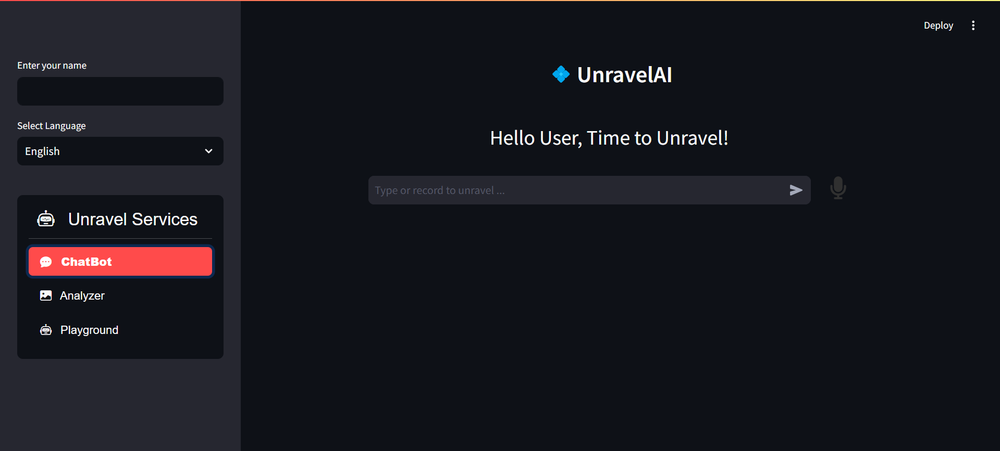

# 💠 UnravelAI



UnravelAI is an innovative multi-functional AI platform that provides services such as a chatbot for conversational AI, image captioning, and more. With support for multiple languages, users can interact with the system either via text or voice, allowing for a seamless experience.

## 🚀 Features

- **Chatbot**: Engage with an AI-powered chatbot for answering questions and generating responses based on user input.
- **Image Analysis**: Upload images and receive proper analysis describing the content of the images.
- **Voice Interaction**: Record voice input, which is then transcribed and processed to generate responses.
- **Multilingual Support**: Supports various languages, including English, Hindi, Urdu, French, and more.
- **User-Friendly Interface**: Built with a modern UI using **Streamlit**, making it easy for users to interact with the AI.

## 🛠️ Technologies Used

- **Python**: Backend logic and AI models.
- **Streamlit**: For the frontend UI.
- **Audio Recorder Streamlit**: Used for voice input functionality.
- **Pillow (PIL)**: Image handling and captioning.
- **Gemini API**: AI language model for generating responses.
- **Other Python Libraries**:
  - `os` for file handling
  - `tempfile` for creating temporary files
  - `streamlit_option_menu` for the sidebar menu
  - `streamlit_util` for utility functions like headers and other custom components

## 📦 Installation

To run the project locally, follow these steps:

### Prerequisites

1. Python 3.x
2. Streamlit
3. Other required dependencies

Check out [requirements.txt](requirements.txt) for more details.

### Steps

1. **Clone the Repository**
    ```bash
    git clone https://github.com/user-name/UnravelAI.git
    cd-voice-chatbot-streamlit
    ```

2. **Create a Virtual Environment**
    ```bash
    python -m venv venv
    source venv/bin/activate  # On Windows, use `venv\Scripts\activate`
    ```

3. **Install Dependencies**
    ```bash
    pip install -r requirements.txt
    ```

4. **Set Up Secrets**
    Create a `.streamlit/secrets.toml` file and add your API keys:
    ```toml
    [gemini]
    api_key = "YOUR_API_KEY_HERE"
    ```

5. **Run the App**
    ```bash
    streamlit run voicechatbot.py
    ```

## 📈 License

This project is licensed under the [MIT](https://opensource.org/license/mit/) License. Check the [LICENSE](LICENSE) file for more details.
